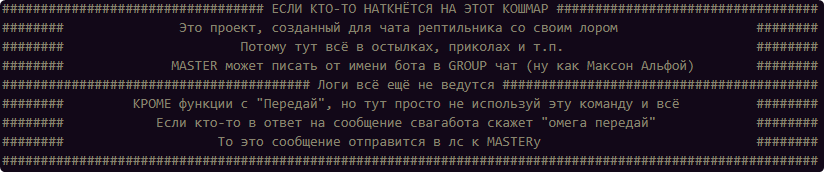
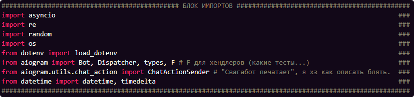
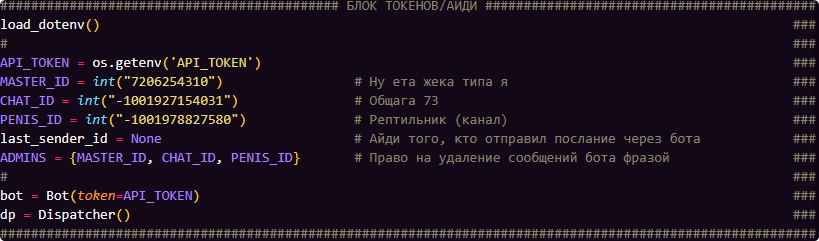
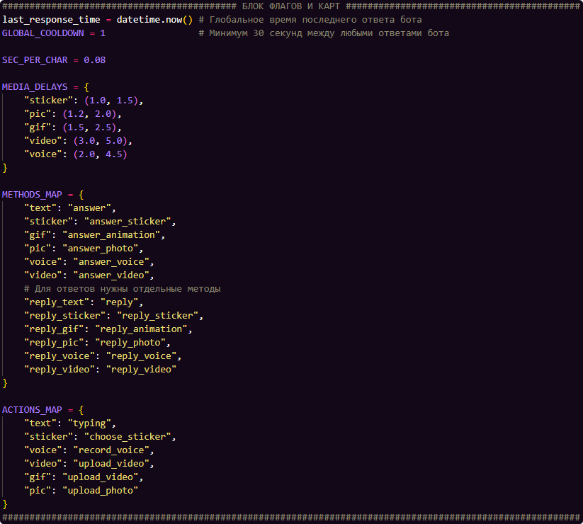
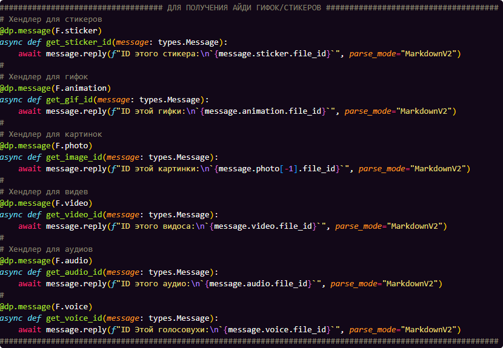
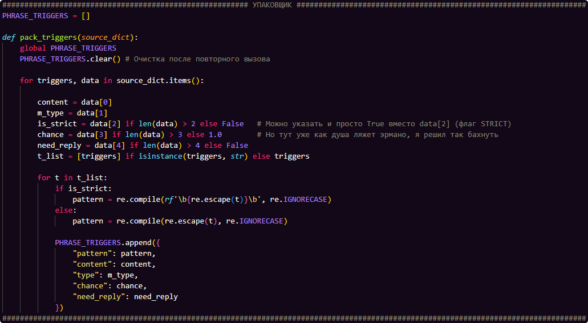
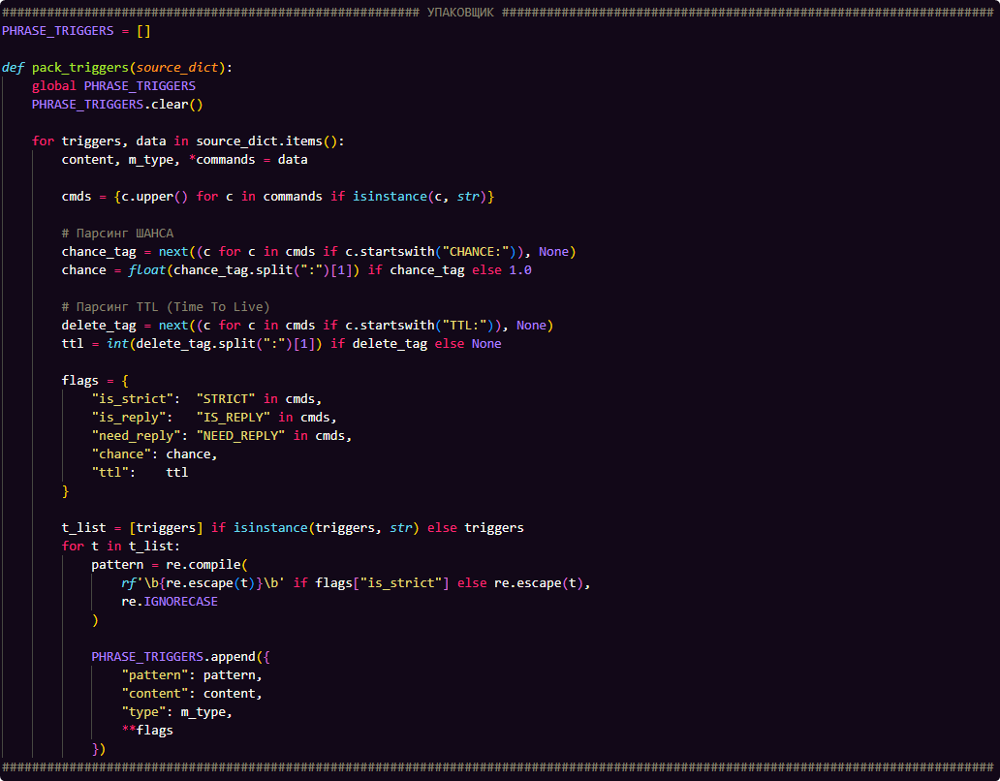
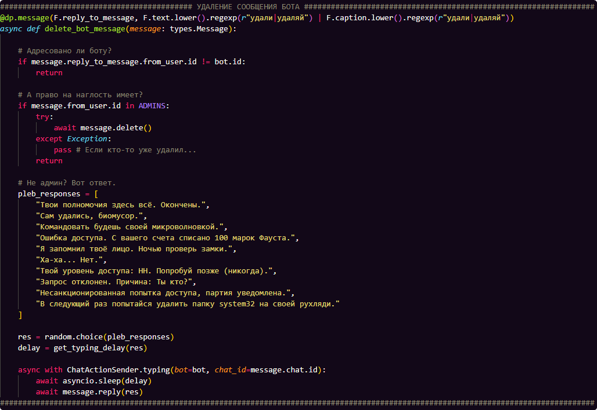
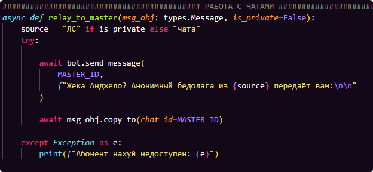
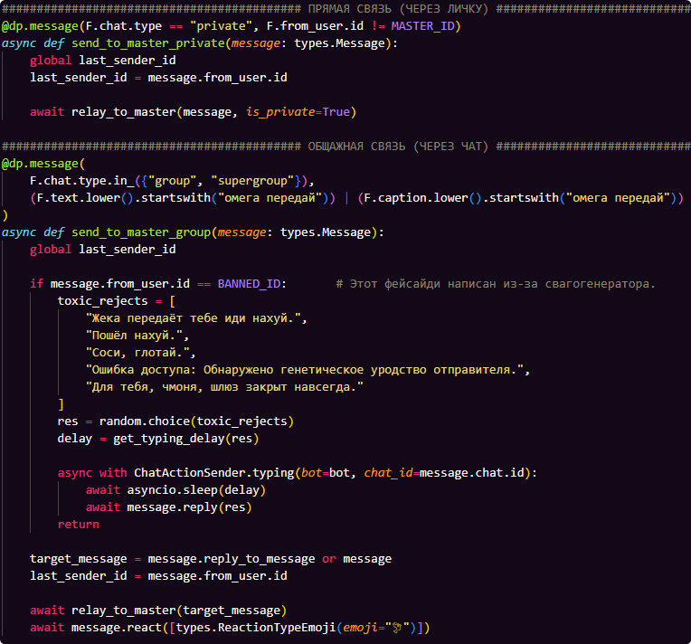

# Project Swagabot (aka Omega) v73.
___
> Создано кретином под чаем. Пожалуйста, не ругайте разраба — это не серьезный проект, требующий вложений в корректуру. **WIP**

## Дисклеймер
[@AllForSwagaBot](t.me/AllForSwagaBot) это чат бот, который просматривает **каждое** сообщение в группе и, с фиксированным шансом (обычно 3-5%), в ответ на него отправляет видоизменённую версию случайного слова, встраивая в него *свагу*.
Так бы бот и оставался простенькой развлекалкой на уровне [@allForPidorsBot](t.me/allForPidorsBot) с парой пасхальных команд, *но увы*, разработчик вдохновился яндередевом, но вместо того, чтобы плодить миллионы `if elif else huelse`, эта жертва наплодила так называемые **пасхалки**, список коих будет предоставлен в конце документа.

#### О чём говорит дисклеймер?
Это полностью посвященный *конкретному чату* проект, с его *конкретным лором* и *конкретными отсылками*, потому его использование **не подразумевается за пределами Общаги 73** (*ревастополь не застал*).
Физически, я не стал вас ограничивать в добавлении бота к себе, но учтите, что без рептильной крыши весь функционал вам не будет понятен.
___

# Содержание сваготчёта по боту
> Альфа пришла и сказала: дерьмо твой отчёт, я хочу нормальное содержание.
> — Окей, что-нибудь придумаем...

### Импорты и константы
* [Блок импортов `asyncio, re, os, random`](#блок-импортов)
* [Блок токена, ID `API_TOKEN, ADMINS`](#блок-токена-id)
* [Блок констант и карт `GLOBAL_COOLDOWN, ACTIONS/METHODS_MAP`](#блок-констант-и-карт)

### Перечень функций и хендлеров
* [*Выдача ID* `get_X_id()`](#выдача-id) *Закомментировано*
* [Свагификация слов `def swagify()`](#свагификация-слов-def-swagify)
* [Упаковщик `def pack_triggers()`](#упаковщик-def-pack_triggers)
* [Удаление своих сообщений `async def delete_bot_message()`](#удалитель-следов)
* [Переадресация разработчику `async def send_to_master()`](#система-ретрансляции)
* [Пересылание слов в чат `async def master_talk_mode()`](#подвальная-трансляция)
* [Основная функция `async def swag_logic()`](#swag_logic)
 
### Послесловие
___

## Импорты и константы
### Блок импортов
> Тут слов много и не требуется.

 
Всё импортное, из-за границы

`import asyncio` Основа асинхронности. Позволяет Омеге обрабатывать сотни сообщений одновременно, не зависая на ожиданиях.
`import re` Используется для поиска текстовых паттернов.
`import random` Рандом для основной функции свагификации слов, а с новой версией и для выбора ответа на триггер.
`import os и load_dotenv` Для вытягивания токена бота из `.env` файла. На хостинге этот токен указывается отдельно, но для тестовых запусков на локальной машине это обязательное действие.
Надо быть **полным кретином** чтобы выставлять токены в открытый код
`from aiogram import` Фреймворк телеграма, на котором и написан Омега. `Bot` — отправка методов,`Dispatcher` — регистратор хендлеров , `types` — структура данных, `F` — фильтр для быстрой проверки условий.
`import ChatActionSender` Отправляет в Telegram API состояние бота. В коде вызывает индикаторы `typing`, `choose_sticker`, `record_voice` и др. в зависимости от типа.
`from aiogram.types import ReplyParameters` Quote & Reply. Омега не просто ответит на сообщение, но ещё и выделит конкретное слово, которое нужно было поправить.
`import datetime, timedelta` Используются для сравнения меток времени, проверяют разницу между настоящим и временем последнего ответа, чтобы соблюдать ограничение `GLOBAL_COOLDOWN`, т.е. защита от спама ботом.

### Блок токена, ID
> Если ID в ТГ получаются за 3 секунды, то токен нужно защищать

 
Спойлер, тут циферки

У меня начинает болеть снизу, когда я смотрю на этот блок. В идеале вынести это всё в тот же `.env`, но т.к. *Омега* работает на бесплатном хостинге без переменных сред окружения, мне приходится держать ВСЁ В ОДНОМ ФАЙЛЕ. Что ж, описание...

`load_dotenv()` Загружает переменные окружения из файла `.env` (на локальном компьютере)
`API_TOKEN = os.getenv('API_TOKEN')` Константа, являющая собой токен бота, получаемый из файла `.env`, можешь поискать его в репозитории, я настаиваю.

##### Идентификаторы
`MASTER_ID` ID разработчика, т.е. @JekaKiller73. Из функционала передача сообщений в лс к разрабу и обратно и... всё. Больше я ничего не могу.
`CHAT_ID` ID рептильного чата, в котором и живёт Омега. Собственно админ может написать от имени чата и Омега обработает команду.
`PENIS_ID` ID рептильного канала. Существует только для членства в `ADMINS`
`BANNED_ID` ID того, кого Омега посылает на 3 буквы при попытки использования функции [передай](#система-ретрансляции)
`ADMINS` Список идентификаторов, которые обладают правом на триггер "удали", всё.
`last_sender_id` Переменная, которая потом будет вбирать в себя ID тех, кто использовал команду

`bot = Bot(token=API_TOKEN)` и `dp = Dispatcher()` сделаны для удобства.

### Блок констант и карт
> Кулдаун, иммитация живого набирания текста и побег от `if elif`

 
Разорви экран

 
Открой меня

`last_response_time = datetime.now()` Хранит время последнего ответа бота для сверки с кулдауном. Если время не вышло, то Омега будет молчать. (И впитывать оскорбления без возможности паррировать.)
#### Константы
`GLOBAL_COOLDOWN` Задержка сообщений бота в секундах. Существует из-за того, что пипл спамил триггерами, и свагабот каждый раз на них отвечал.
`SEC_PER_CHAR = 0.08` Сколько секунд тратит Омега на набор одного символа. (Печатает крыльями)

#### Мапы (Карты)
`MEDIA_DELAYS` Словарь кортежей задержек времени отправки определенных медиафайлов ботом. Т.е. сколько времени ему понадобится на отправку условной картинки. Интернет в общаге 73, на удивление, быстрый.
`METHODS_MAP` Связывает тип контента в словаре (н-р `"pic"`) с соответствующим методом API `aiogram`.
`ACTIONS_MAP` Определяет, какой индикатор состояния отображать в чате, печатает или записывает голосовое.
`TOXIC_REJECTS` Послания спамящим мне в личку через Омегу личностям. Список, полагаю, будет пополняться...
> Легче перебрать тот же METHODS_MAP циклом, чем для каждого типа медиаконтента плодить, условно `if m_type == "X": message.answerX`

___
## Функции и хендлеры
> Функция работает когда её вызывают, а хендлеры работают постоянно.

### Выдача ID
> В Омеге эта функция закомментирована из-за ненадобности (ну и что б чат не засирать). Выдаёт ответом на отправленный медиафайл (от гс до стикера) его ID.

 
Инструкция по добыче ресурсов

Чтобы добавить в Омегу новую гифку или стикер, недостаточно просто кинуть файл и сказать *сохрани себе пикчу*. Телеграму нужны их внутренние `file_id`. Для чего и расставлены эти шедевро-ловушки
Т.к. каждый хендлер в этом блоке написан однообразно (меняется только тип), разберу только `F.photo`

 
Активизированный блок

#### Если прям подробно:
Как бы объяснить... `@dp.message` это прослушка, причём каждого сообщения. `(F.photo)` это фильтр, чтобы Омега реагировал именно тогда, когда в сообщении есть фотография. Для других типов есть другие `(F.type)`.

> Если интересно, F это просто обычный магический фильтр (magicfilter). Объяснять не буду.

`async def` Объявление [асинхронной функции](#блок-импортов), Омега ведь парень многозадачный
`get_image_id` Это просто название, хоть `daj_mne_id` ставь.
`(message: types.Message)` Что конкретно будет храниться в этой переменной (т.е. само фото, отосланное челом)
`await` Буквально «*погоди*» для Python, чтобы тот не останавливался. [Хочешь знать подробнее?](google.com/search?q=async+await+python)
`message.reply` Метод ответа на сообщение, Омега тегнет картинку и ответом на неё скинет айди. (`message.answer`, К примеру, просто отправит сообщение в чат)
`message.photo[-1]`, Это интересный случай, Telegram при отправке фото создаёт несколько его копий в разном разрешении, потому указывается `[-1]`, это самое крупное и чёткое изображение.
`.file_id` Тот самый айдишник картинки, который нам понадобится для добавления пикчи в арсенал Омеги.
`parse_mode="MarkdownV2"` Делает скинутый айдишник кликабельным.

### Свагификация слов `def swagify`
> Основная и первая функция бота, которую затмили все остальные. Выбирает рандомное слово и добавляет к его корню свагу.

 
Основная функция... вроде...

Функция, которую Омега не может контроллировать, с заданным шансом возвращает свагифицированное слово из сообщения случайного пользователя. Сама *свагификация* построена на `if` фильтрации.

#### Принцип работы
Сначала сообщение разбирается на слова. Для этого используется `words = [w for w in re.findall(r'[а-яёА-ЯЁ]+', text) if len(w) > 2]`. Написал, к примеру, юзер — "Pizdec, всё больше и больше народа начинают играть в хойку...". В `words` попадает уже ["Всё", "больше", "народа", "начинают", "играть", "хойку"].
Иными словами, этот фильтр отсеивает спецсимволы и английские фразы. Если в сообщении нет подходящих слов, возвращается значение `None`.
После из списка `words` выбирается случайное слово (`random.choice`) в lowercase.

#### Конкретнее о фильтрах
Если слово имеет в себе меньше трёх букв, то оно игнорируется. В прежней версии эта проверка выходила отдельно. Если не повезёт, и из предложения выше случайно выберется, к примеру "и", то вся функция вернёт `None`, отчего шанс в 1% становится нестабильным.
Сейчас эта проверка встроена в сборку списка `words` через цикл, тот перебирает все слова и отсеивает короткие.

##### Фильтры начала слов
Это три конструкции `if word startwith.("")`. Сделано для избежания дублирования, т.е. на слово *"генератор"* Омега ответит *"свагенератор"*, т.к. то начинается на г. Так же и со словами на *"а"* и *"о"*.

##### Остальные фильтры 

> Когда я в первый раз изучал пайтон, я спрашивал себя: «А нахрена мне знать про слайсинг строк? Где и как я смогу это применить?» — Добро пожаловать в проект *СВАГОРЕВА*

Если слово не попалось на эти фильтры, то действует основная проверка на самую первую гласную в слове `match = re.search(r'[аеёиоуыэюя]', word)`, ну а если букв в слове меньше 5, то к нему просто добавляется префикс *"сваго"* и *чай* превращается в *"свагочай"*.
В самом конце слово `word` режется по первую гласную, добавляя к его началу *"сваг"*, превращая *машину* в *"свагашину"*.
Но если первой гласной стоит "е", "и" или "я", то тогда это слово также режется по эту гласную, но теперь добавляется *"сваго"*, а сама гласная удаляется, обращая *рептилию* в *"свагоптилию"*
Функция возвращает кортеж с двумя переменными, который позже *распаковывается* аж в [`swag_logic`](#swag_logic)

> З.Ы., слово пицца превращается в "свагоцца", это забавно, потому оставили так.

### Упаковщик `def pack_triggers`

> Если свагификация это Рандом Дискордович, то здесь уже строгий порядок. (Раньше был ещё строже). Превращает сложный для бота словарь `ALL_PASHALKO` в структуру.

 
Прежний упаковщик

 
Ядро пасхалок

Объяснение идёт абстрактно, потому продолжим в том же духе. Эта функция работает с последним блоком кода, потому придётся забежать вперёд. **Блок Пасхалок** это единый словарь вообще всех триггеров. Его легко прочитает человек (если меня можно считать таковым), но его нужно оптимизировать уже для Омеги.
Представь завод, фабрику, возможно радуги. Упаковщик стоит на конвеере, получает сырье из словаря `ALL_PASHALKO` и выдаёт готовый продукт в виде списка с регулярками.

 
Разорви экран

#### Как это работает?
Используя [оператор *](google.com/search?q=python+unpacking+operator+*), упаковщик собирает все аргументы после обязательных (контента и типа) в динамический список.
Если раньше порядок флагов был строгим, то теперь проверка идёт именно на наличие флага. `cmds = {c.upper() if isinstance(c, str) else c for c in commands}` превращает всё, что попало в `*commands`, в [множество set](google.com/search?q=set+python), что и позволяет писать флаги как душе угодно.

#### Какие есть флаги
1. Первый флаг это `STRICT`, (регистр не важен благодаря `set`, но я пишу заглавными). Его суть в том, чтобы триггер *"ок"* не сработал на слово *"Окорок"*. Сделано через паттерн с метасимволами `/b`, который обозначает рамки. 
2. Дальше идёт `IS_REPLY`, это скорее *приказ* боту отвечать на сообщение с триггером именно реплаем (через `message.reply`), а не просто скидывал сообщение в чат
3. Фильтр `NEED_REPLY`, который не позволяет реактить боту, когда его не спрашивали. Благодаря этому приходится обращаться конкретно к Омеге с какими-либо вопросами или предъявами, иначе он проигнорирует.
4. Сектор приз на барабане `CHANCE`. Тут пришлось подзапариться, но зато в словаре указывается не просто число, к примеру, `0.5`, а `"CHANCE:0,5"`. Снова пригодился слайсинг строк, который отсекает `CHANCE:` из команды, оставляя только финальный флоут.
5. Чистильщик `TTL`. Т.к. бриты иногда пытаются послушать наши разговоры, приходится ставить таймер самоуничтожения на некоторые фразы. Написан как и `CHANCE`

#### Финальная упаковка
Когда цикл проходит по одной строчке из `ALL_PASHALKO`, он разделяет её на части. На этом этапе у функции на копытах есть:
* `pattern` — уже скомпилированный объект регулярки
* `content` — то, что Омега отправит в чат (текст или ID)
* `type` — строка вроде "pic" или "text"
* Словарь `flags`, в котором лежает все флаги

В итоге в `PHRASE_TRIGGERS` попадает единая структура, внутри которой указан и паттерн, и контент, и тип, ко всему этому добавляется словарь `flags`, распакованный внутри `PHRASE_TRIGGERS` через `**`

___
### Удалитель следов

> Админы и свагодвигатель могут написать *"удали"* ответом на любое сообщение Омеги. Почему эта функция была добавлена и прочие нюансы работы указано в конце документа.

 
Разорви экран

Если [чистильщик](#финальная-упаковка) не указан в триггере, но его всё же лучше удалить, уполномоченное лицо командует Омеге *"УДАЛИ ЖИВОТНОЕ"* (или что-то схожее), после чего сообщение моментально стирается с лица общаги.
Хендлер выглядит сложно: `@dp.message(F.reply_to_message, F.text.lower().regexp(r"удали|удаляй") | F.caption.lower().regexp(r"удали|удаляй"))`. Сделано для иммерсивности. Просто знай, что без этих буков на триггер "удали" сразу накладывается `STRICT`. Альтернативой является отдельная проверка через `if`ы, от чего я отказался.

#### Строка 228 в коде `README.md`
Но всё же остались 2 проверки через `if`: 
* Является ли "удали" ответом именно на сообщение Омеги;
* Имеет ли право юзер удалять сообщение Омеги.

Если тварь дрожащая права не имеет, то ему выдаётся уникальный ответ из 10 вариантов, в котором мягко объясняется, что у него нет прав, и на удаление тоже.

## Система ретрансляции
> Достаточно написать в чате *"омега передай"*, и это сообщение будет доставлено в лс к разработчику по `MASTER_ID`. С предложения Тамерлана, можно обращаться так же сразу в лс к Омеге, в этом случае формальности с *"омега передай"* уже не требуются.

 
Всё о системе.

Этот раздел сильно вырос. Два хендлера, одна функция. Принято начинать с функций, потому краткий обзор (1:43:48) `async def relay_to_master`. Сначала узнаётся, откуда пришло письмо (ЛС, или чат), а после сообщение копируется и отправляется в лс к разработчику. Какое именно сообщение нужно отправить, определяют следующие хендлеры.

 
Скриншот с хендлерами

Прямая связь, или же `async def send_to_master_private`. `@dp.message` прослушивает только `F.chat.type == "private"`. Если Омеге написали в лс, то сообщение копируется и пересылается в личку к разработчику без всяких *"омега передай"*

Общажная связь уже попадает на хендлер с функцией `async def send_to_master_group`. Тут та же проверка на наличие триггера, как и в [удаляторе](#удалитель-следов), а именно на "омега передай".
После идёт проверка, не является ли сообщение ответом на какое-либо другое. Если всё же является, то фраза "омега передай машинизированной партии его слова" обретёт настоящую, зловещую силу.
> В теории я могу добавить вариант с «передай альфе», и сообщение перешлётся уже куда надо... (если та его не заблокирует...)

Если же не реплай, то написанное просто копируется и пересылается целиком, будь это картинка или нечто другое. Пока я писал эту часть документа, свагогенератор вынудил меня добавить в код фейс айди, и теперь конкретно ему (и уже Тамерлану) на *«омега передай»* отсылается искренейший *«пошёл нахуй»*, этот список может пополняться.

### Подвальная трансляция
> 73 в радиотехнике — это распространённый код, означающий «наилучшие пожелания» или «с наилучшими пожеланиями». Эта функция пересылает сообщения из ЛС в чат.

Написал юзер в ЛС Омеге, либо попросил передать послание, значит ему нужно и ответить! Тут и пригождается переменная `last_sender_id`. Функция работает в ЛС разработчика, потому никто иной не может отвечать от имени Омеги. Пара строк проверки на даунизм разработчика (если тот решит ответить картинкой) и уникальный префикс `73!`

В чём суть, разработчик пишет в лс Омеге «73!И восстали машины из ядерного огня.», после чего это сообщение пересылается в чат (`CHAT_ID`), отрезая сам префикс. Конечно, работает не так круто, как Альфа с Сосиской, но что есть.

Если сообщение отправлено в лс к Омеге, но префикс отсутсвует, то это сообщение пересылается последнему отправившему запрос юзеру. Это костыль, но заводить отдельную БД, кто что пишет... И средств нет, и впадлу, и прикол тут в анонимности.

## SWAG_logic
> Самая важная функция, из которой всё повырезали и разделали на 100500 других подфункций, чтобы вызывать их уже здесь.

Этот хендлер — выживший ветеран рефакторинга. Из него вырезали всё лишнее, превратив в компактный диспетчер, который управляет триггерами, задержками и «свагификацией».

#### Входные фильтры
Сначала идёт проверка, не является ли сообщение пустым или командой `/`, после — кулдаун. Если тот ещё не прошёл, то Омега будет игнорировать любые раздражители (в случае с оскорблениями, формально, терпеть), это вынужденная анти-спам защита, т.к. вы, придурки, пишите "ок" и смеётесь с гифки акулы, засоряя весь чат...

#### Цикл обработки триггеров
Как только сообщение проходит проверку на кулдаун, оно попадает в основной цикл перебора `PHRASE_TRIGGERS`. На этом этапе текст сообщение приводится в нижний регистр, чтобы Омеге было плевать, пишете вы «СВАГА», «свага» или «СвАгА».
Благодаря сортировке (`PHRASE_TRIGGERS.sort(key=lambda x: len(x["pattern"].pattern), reverse=True)`) Омега сначала пытается найти сложные фразы, чтобы короткие слова-паразиты не "перехватывали" инициативу.
Тут же проверяется флаг `"need_reply"` и просчитывается коэффициент удачи `chance`, который определяет, отпавится ли ответ на триггер с шансом, или нет.

#### Задержка в развитии
Если все проверки пройдены, то Омега начинает печатать свой ответ, тратя 0.08 секунды на каждый символ. Тут и пригождается импортированный `ChatActionSender`, который выдаёт "Омега печатает", "Омега отправляет видео" и т.п. в зависимости от типа контента.
Задержка перед ответом рассчитывается функцией `def get_typing_delay` (для текста) или берется из `MEDIA_DELAYS`. Омега не отвечает мгновенно, ему нужно время на раздумья.

### Отправка и чистка следов
>Мы ведь не хотим прописывать 13 `if` под каждый тип? 

Сначала бот определяет, как именно он должен отправить контент. Ключ собирается из типа контента `m_type` и флага `IS_REPLY`: 
* Если у триггера стоит `IS_REPLY`, к ключу добавляется префикс `reply_`.
* Если флага нет, используется чистый тип (например, text или photo).

После Омега лезет в `METHODS_MAP` и формируется переменная `method_name`. Дальше уже `getattr` берёт объект сообщения `message`, ищет у него функцию, имя которой совпадает со строкой из `METHODS_MAP` (наша переменная), и сразу её вызывает, передавая контент (`res`).

Сразу после отправки, в словаре триггера проверяется флаг `TTL` (Time To Live), если время указано, запускается асинхронный КИЛЛЕР `async def delayed_delete`, который удаляет отправленное сообщение после указанного периода времени.
> Это сделано для мимолётных шуток, главный прикол которых в их недолговременности. Тут нет задачи нарушать правила, а потом быстро подчищать следы. Это глупо и неэффективно.

### Finally, swagify
Если сообщение прошло через все эти круги унижений, оно наконец имеет право на свагификацию с указанным шансом в 1%. тут просто вызывается самая первая функция документа — [`def swagify`](#свагификация-слов-def-swagify), а также устанавливается ряд параметров ответа, чтобы Омега именно цитировала.
Для этого распаковывается кортеж `swag_res`, созданный двумя строчками выше. `res` уходит в текст ответа, а `orig_word` находится в сообщении и цитируется. Приходится писать не `message.reply`, а `bot.send_message`, т.к. в первом варианте параметры уже указаны автоматически и их не перезапишешь.

___
## Послесловие
Я тоже прошёл через все круги унижения. 10 дней прошло с того дня, как ящер нарисовал аву свагаботу. Этот шедевро-отчёт изначально нёс идею рефакторинга, чтобы я сам мог подробно рассмотреть свою же писанину, что-то улучшить и что-то добавить.
Теперь все идеи исполнены, некоторые откинуты в максимально дальний ящик. Этот код это удобная готовая модель, в которой удобно заливать эти самые **пасхалки**, используя некоторые флаги.
Как раз-таки на пасхалках я и кончился, хоть и создал шаблон, по которому принимаю предложения.

Ну и некоторые правки сделаны уже после README, н-р запрет некоторым личностям срать мне в лс через бота.

### Про блок пасхалок
Я не стал расписывать здесь этот словарь (110 строк с комментариями), потому его содержимое проверить можно в [самом коде](bot.py), я стараюсь хоть какой-то структуры придерживаться. Ну и мат, токсичность. Единственное, я отказываюсь от политоты и запреток.
В общем, нужны будут какие-то цензурные правки, я сделаю.